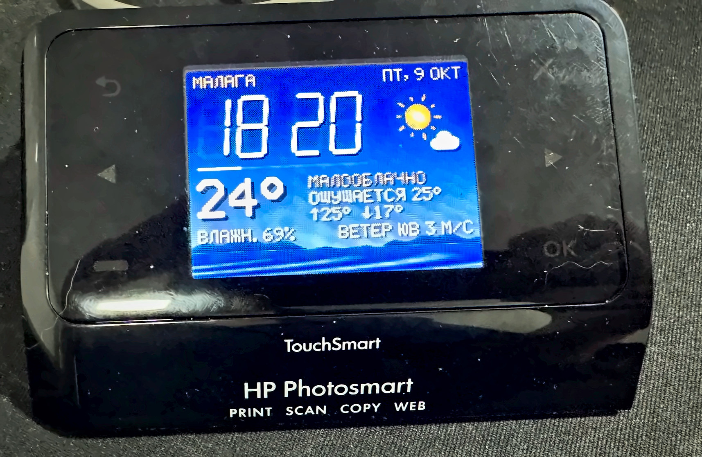
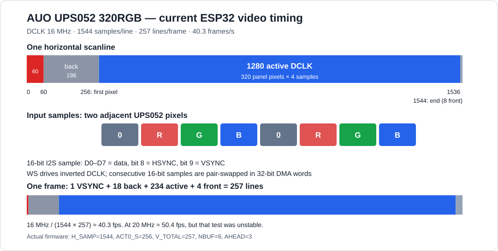
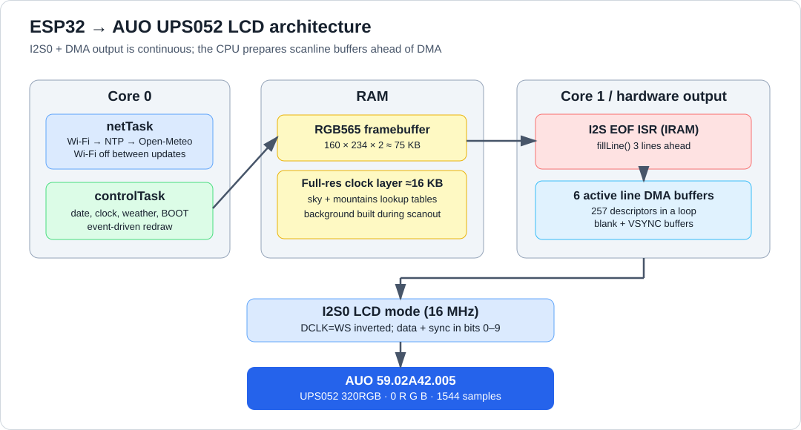

# HP Photosmart TouchSmart LCD → ESP32 Weather Clock

Reverse engineering of an **AUO 59.02A42.005** LCD salvaged from an HP printer. The display runs directly from an ESP32-WROOM-32 using the original 8-bit parallel bus, hardware **I2S0 LCD mode + DMA**, and the recovered **UPS052 320RGB** video format.




## Hardware


| Component | Identified hardware |
|---|---|
| LCD | AU Optronics `59.02A42.005` (family similar to **A024CN02 VJ**), 2.36-inch class |
| Active dot array | 480 × 234 physical RGB dots; UPS052 input 320 RGB pixels × 234 lines |
| Interface | 8-bit parallel data + DCLK / HSYNC / VSYNC, 40-pin FPC |
| Original board | HP Photosmart TouchSmart `CN245-60001` |
| Panel controller | Cypress `CY8C20546-24PVXI` (touch/LED/serial control; **not** video) — disconnected from the LCD serial lines, see below |
| Replacement MCU | ESP32 DevKit V1 / ESP-WROOM-32, without PSRAM |
| Board supply | 3.3 V to the original power rail; existing analog voltage circuitry retained |
| Backlight | development jumper from +3.3 V to `LED_ANODE` |

---

## Board reverse engineering

The HP Photosmart TouchSmart control board (PCB `CN245-60001`) contains a Cypress `CY8C20546-24PVXI`, touch controls and a 40-pin AUO LCD FPC. Tracing the removed host-connector pads showed that **D0–D7, DCLK, HSYNC and VSYNC run directly to the display, bypassing the Cypress**. The printer mainboard was generating the raw video; the ESP32 can replace it without an extra LCD controller.


### Recovered LCD pinout

| FPC pin | Signal | ESP32 | FPC pin | Signal | ESP32 |
|---:|---|---|---:|---|---|
| 40 | D0 | GPIO13 | 33 | D7 | GPIO22 |
| 39 | D1 | GPIO14 | 32 | DCLK | GPIO23 |
| 38 | D2 | GPIO16 | 31 | VSYNC | GPIO26 |
| 37 | D3 | GPIO17 | 30 | HSYNC | GPIO25 |
| 36 | D4 | GPIO18 | 29 | SCL | not connected (Cypress pin lifted) |
| 35 | D5 | GPIO19 | 28 | SDA | not connected (Cypress pin lifted) |
| 34 | D6 | GPIO21 | 27 | CS | not connected (idle at 3.3 V) |

### Why the Cypress had to be disconnected

In longer use the panel occasionally came up after power-on in the wrong input mode: **UPS051** instead of UPS052 320RGB. The picture was stretched about 2.7× horizontally, shifted to the right, with scrambled colours, and it stayed that way until the next power cycle. Switching the ESP32 output to UPS051 timing made that state display correctly, which confirmed that the panel itself had changed mode (register `R3`, field `SEL`).

The CY8C20546 is the only other device on the panel's serial-control lines. Without the printer mainboard it kept switching the LCD between modes on its own, so it had to be disconnected: its **`SDA` and `SCL` pins were lifted off the PCB**. It can no longer write to the panel, and the LCD runs on its default registers, which is exactly the UPS052 320RGB mode the firmware expects. `CS` sits at 3.3 V (inactive). The exact trigger inside the PSoC was not traced further.

The panel-side `SDA`/`SCL` pads are now free. A future option is to drive them from the ESP32 and write the input mode explicitly at every boot (see [Further ideas](#further-ideas)).

**Power:** 3.3 V on the wide `3.3V` PCB trace brings up the panel and its existing analog/charge-pump circuitry. An electrolytic capacitor and 0.1 µF ceramic capacitor were added at the power input.

**Backlight:** the screen produces an image without the printer but the LED anode is unpowered; a temporary 3.3 V jumper to `LED_ANODE` lights the backlight at reduced brightness.

For the traced Q11/Q12/`XI` circuit, meter readings, analog FPC pins and photos, see **[Detailed board teardown](docs/REVERSE_ENGINEERING.md)**.

> ESP32-WROVER/PSRAM variants can reserve GPIO16 and GPIO17. Remap D2 and D3 to free GPIOs before using such a board.

## Video format and timing

### UPS052 320RGB

The A024CN02 datasheet lists several input formats. Without serial configuration, this panel expects **UPS052 in 320RGB mode** (datasheet section c-1):

- **320 pixels per line, 4 DCLK cycles per pixel:** `dummy, R, G, B`, a full byte per colour.
- 320 × 4 = 1280 active cycles per line.
- The panel maps RGB onto its delta dot layout by itself; no alternating-row RGB permutation is required in this mode.



| Parameter | Datasheet (UPS052 320RGB) | Used here |
|---|---|---|
| DCLK | 16 … 24.545 … 27 MHz | **16 MHz** |
| Line length | 1472 … 1560 … 1644 cycles | **1544** |
| HSYNC pulse | ≥ 1 cycle | 60 |
| Line start → first active sample | 220 … 252 … 283 | **256** (set with an on-screen 0–9 ruler at the edges) |
| Active cycles | 1280 | 1280 |
| Lines per frame | — | 1 (VSYNC) + 18 + 234 + 4 = **257** |
| Frame rate | ≥ 50 Hz recommended; current build below this | 16 MHz / (1544 × 257) ≈ **40.3 Hz** |

| DCLK | Result |
|---|---|
| 10 / 13.3 MHz | jitter: below the datasheet minimum of 16 MHz |
| **16 MHz** | stable, best picture |
| 20 MHz | picture occasionally drops out, cause not found yet |

**How to spot the wrong mode:** if you send 480-cycle lines, one byte per dot as in the UPS051 format, the panel still reads 4 cycles per pixel. That is 120 pixels out of 320, so the whole image ends up squeezed into the left part of the screen (left photo). With the right mode and the `0 R G B` byte order, the calibration screen comes out clean (right photo).

<p>
  
  
</p>

### I2S0 LCD mode + DMA

Bit-banging GPIOs (`GPIO.out_w1ts` / `out_w1tc`) is enough to bring the panel up, and the first test image was drawn that way. It does not survive Wi-Fi, though. **If DCLK pauses even briefly, the panel can flash white** before recovering. In the original GPIO experiment, Wi-Fi-related interference was observed at approximately 100–560 µs, with a much longer disruption (around 64 ms) during startup. Those values describe the tested bit-bang implementation, not measured pause lengths of the DMA output.

So the signal is generated by hardware. The **I2S0 peripheral in LCD mode, fed by DMA**, produces DCLK, the sync signals and the data. The CPUs only prepare lines in memory ahead of time, so normal task scheduling does not directly stop the clock. DMA underrun/ISR overload remains a separate limitation.



- **One 16-bit sample per DCLK cycle.** Bits 0–7 are D0–D7, bit 8 is HSYNC, bit 9 is VSYNC. Samples are packed two per 32-bit word, with the pair order swapped.
- **DCLK is the I2S0 WS signal** on GPIO 23, **inverted** in the GPIO matrix. Without the inversion the screen stays white.
- **Clock:** 160 MHz / (N + B/A) / BCK / 2. With N = 2, B/A = 1/2 and BCK = 2 that gives 16 MHz.
- **257 DMA descriptors in a closed loop,** one per line of the frame. Sync and blanking lines point at fixed buffers. Visible lines use a ring of 6 buffers that an end-of-line interrupt (core 1, in IRAM) fills 3 lines ahead.

```cpp
// data + sync -> I2S0 OUT8.. (16-bit mode)
const uint8_t pins[10] = { 13, 14, 16, 17, 18, 19, 21, 22, /*HSYNC*/ 25, /*VSYNC*/ 26 };
for (int i = 0; i < 10; i++)
  esp_rom_gpio_connect_out_signal(pins[i], I2S0O_DATA_OUT8_IDX + i, false, false);
// DCLK = WS, inverted
esp_rom_gpio_connect_out_signal(23, I2S0O_WS_OUT_IDX, /*invert*/ true, false);

I2S0.conf2.lcd_en = 1;                        // LCD mode
I2S0.sample_rate_conf.tx_bits_mod = 16;
I2S0.sample_rate_conf.tx_bck_div_num = 2;     // BCK
I2S0.clkm_conf.clkm_div_num = 2;              // N
I2S0.clkm_conf.clkm_div_b = 1;                // B
I2S0.clkm_conf.clkm_div_a = 2;                // A  -> 16 MHz
```

---

## Rendering and memory

The ESP32 has 520 KB of SRAM, and Wi-Fi needs more than 100 KB of free heap to start. It failed at 89 KB and works at about 129 KB. So:

- **Frame buffer: 160 × 234, RGB565, 75 KB,** allocated row by row to avoid heap fragmentation. Each logical pixel is sent as two panel pixels.
- **Sky and mountains are not stored at all.** The interrupt generates them while building each line, from small tables, at the panel's full 320-pixel width and 8 bits per colour, so the gradients have no banding. Where nothing is drawn over the sky, the frame buffer holds the "transparent" key `0x0821`.
- **Clock digits at full resolution.** They live in a separate 198 × 82-byte layer (16 KB) laid out in panel columns (320 wide). Each byte holds 4 bits of digit coverage and 4 bits of shadow. Every point is supersampled 2 × 2, and the interrupt blends it over the sky in full 8-bit colour.
- **Clean text.** Each logical pixel takes one colour averaged over three neighbouring scene samples, which removes the colour fringing caused by the delta layout.
- **Bayer dithering only on the background** (sky, mountains, sea); text and icons stay crisp.
- **Partial redraws only:** the clock area once a minute, the seconds bar once a second. The colon blinks with a 2 s period, 1 s on and 1 s off.

### Sky modes

| Mode | When |
|---|---|
| Day | between sunrise and sunset |
| Golden hour | ±35 min around sunrise and sunset (times come from Open-Meteo) |
| Night | otherwise; stars when the sky is clear |

---

## Network

Wi-Fi is not kept on. **Every 10 minutes** (1 minute after an error) the network task:

1. turns Wi-Fi on and connects;
2. syncs time over NTP (`pool.ntp.org`, TZ `CET-1CEST,M3.5.0,M10.5.0/3`);
3. fetches the weather from Open-Meteo, over HTTP first and HTTPS as a fallback;
4. **switches Wi-Fi off completely.**

Requested fields: current `temperature_2m`, `relative_humidity_2m`, `apparent_temperature`, `is_day`, `weather_code`, `wind_speed_10m`, `wind_direction_10m`; daily `temperature_2m_max/min`, `sunrise`, `sunset`.

> **Gotcha:** call `esp_sntp_stop()` before `WiFi.mode(WIFI_OFF)`. Otherwise lwIP hits an assert in `pbuf_free` and the board reboots.

---

## Calibration / serial console

Send a key in the serial monitor at 115200 baud (Enter optional). Signal settings are saved to flash (Preferences namespace `auov6`).

| Key | Action |
|---|---|
| `p` / `?` | help and status: DCLK, pixel order, frame rate, free heap, interrupt time |
| `c` or **BOOT** button | calibration screen: R G B bars, grey ramp, rainbow |
| `w` | cycle demo weather: clear day and night, clouds, fog, drizzle, rain, snow, storm, golden hour |
| `r` | fetch the weather now |
| `f` | DCLK: 10 / 13.3 / 16 (fractional divider) / 20 / 16 (integer divider) MHz |
| `i` | invert DCLK |
| `o` | order of the two 16-bit samples in a 32-bit word |
| `k` | shift the pixel by one cycle (correct: `0RGB`) |
| `d` | dithering: off / everywhere / background only |
| `h` | print help and status (same as `?`) |
| `x` / `y` | mirror horizontally / vertically |
| `m` | show only odd or even lines (diagnostics) |

Defaults are the values that worked: DCLK 16 MHz, inverted, pair swapped, `0RGB`, dithering on the background only.

---

## Building and wiring

1. Arduino IDE, board **ESP32 Dev Module** or **DOIT ESP32 DEVKIT V1**, package **esp32 by Espressif 3.3.11** (the version this was tested on).
2. Open [`firmware/AUO_Weather/AUO_Weather.ino`](firmware/AUO_Weather/AUO_Weather.ino).
3. Copy `firmware/AUO_Weather/secrets.example.h` to `firmware/AUO_Weather/secrets.h` next to the sketch and fill in your Wi-Fi name and password. `secrets.h` is git-ignored.
4. For another city, change `LATITUDE`, `LONGITUDE`, `TZ_INFO` and the `timezone` parameter in `WEATHER_QUERY`.
5. Flash and open the serial monitor at 115200.

Arduino IDE quirks worth knowing:

- The IDE inserts function prototypes before the **first function** in the sketch, so every `struct` and type is declared above it.
- Sketch functions must not have default arguments: the generated prototype repeats them and the build fails.
- The target 3.3.11 core uses `soc/gpio_struct.h`, `soc/i2s_reg.h` and `esp_private/periph_ctrl.h` (`driver/periph_ctrl.h` on 2.x).

---

A clean checkout contains **`secrets.example.h`**, not your actual `secrets.h`. Without a copied `secrets.h`, the code builds with placeholder credentials and cannot connect until you enter a network. Never commit personal SSIDs/passwords.

## The finished weather clock

- Large clock with a blinking colon and a seconds bar; day of week and date
- Live weather for Málaga from [Open-Meteo](https://open-meteo.com/): temperature, "feels like", daily max/min, humidity, wind direction and speed, condition text and an icon
- A sky that follows the sun: blue by day, a golden hour around sunrise and sunset, stars at night. Mountains and sea sit on the horizon, and the palette greys out for overcast, fog, rain and storms.
- No white flashes, full-screen, correct colours, smooth gradients and anti-aliased clock digits

The on-screen text is in Russian. The built-in 5×7 font has both Cyrillic and Latin, so changing the language only means editing strings.

---

## References

- [AUO A024CN02 VJ datasheet (PDF)](https://www.beyondinfinite.com/lcd/Library/Auo/A024CN02-VJ.pdf) — related panel family, UPS052 timing (section c-1), pinout and LED ratings. Exact panel revision may differ.
- [Espressif ESP32 Technical Reference Manual (PDF)](https://www.espressif.com/sites/default/files/documentation/esp32_technical_reference_manual_en.pdf) — I2S LCD mode, DMA and GPIO matrix.
- [ESP-IDF I2S documentation](https://docs.espressif.com/projects/esp-idf/en/v5.5.5/esp32/api-reference/peripherals/i2s.html) — LCD/camera mode is supported on I2S0.
- [Open-Meteo forecast API](https://open-meteo.com/en/docs) — weather data.

## License

MIT — see [LICENSE](LICENSE).
