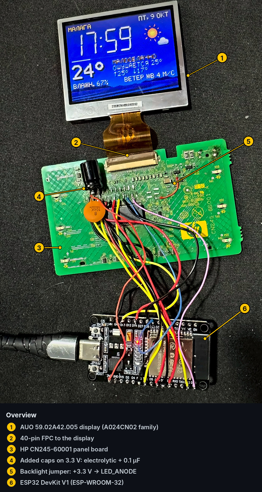
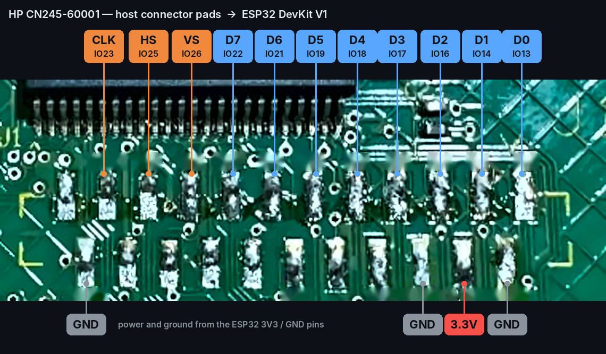
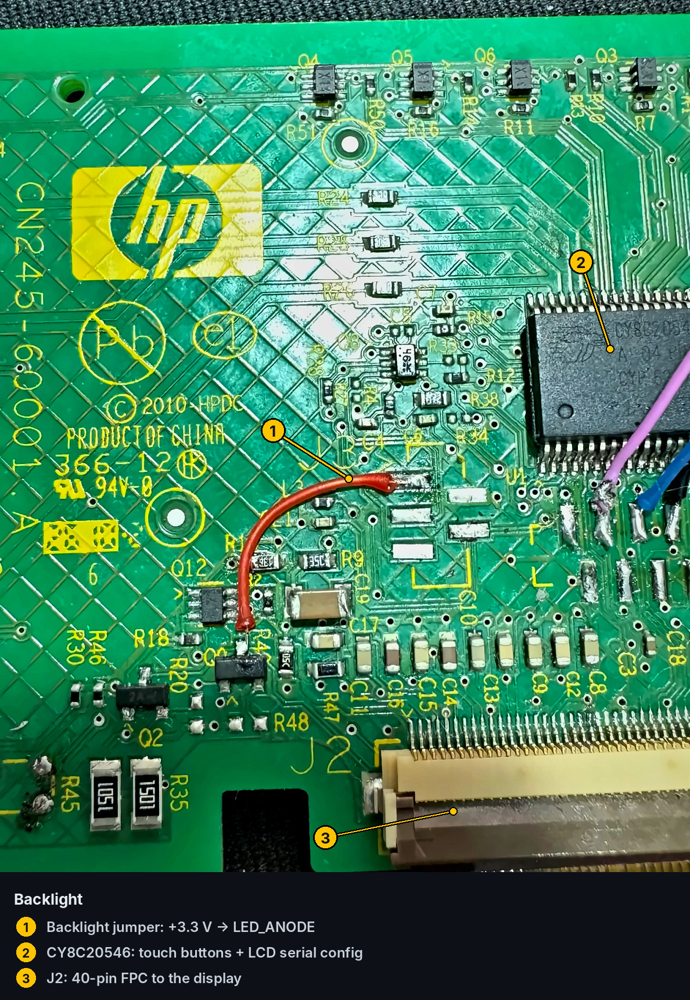
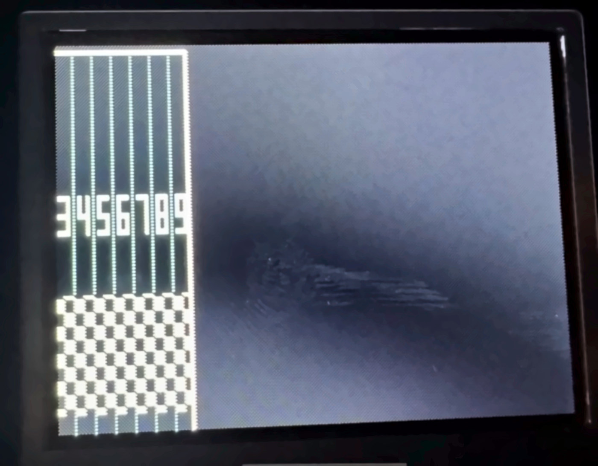
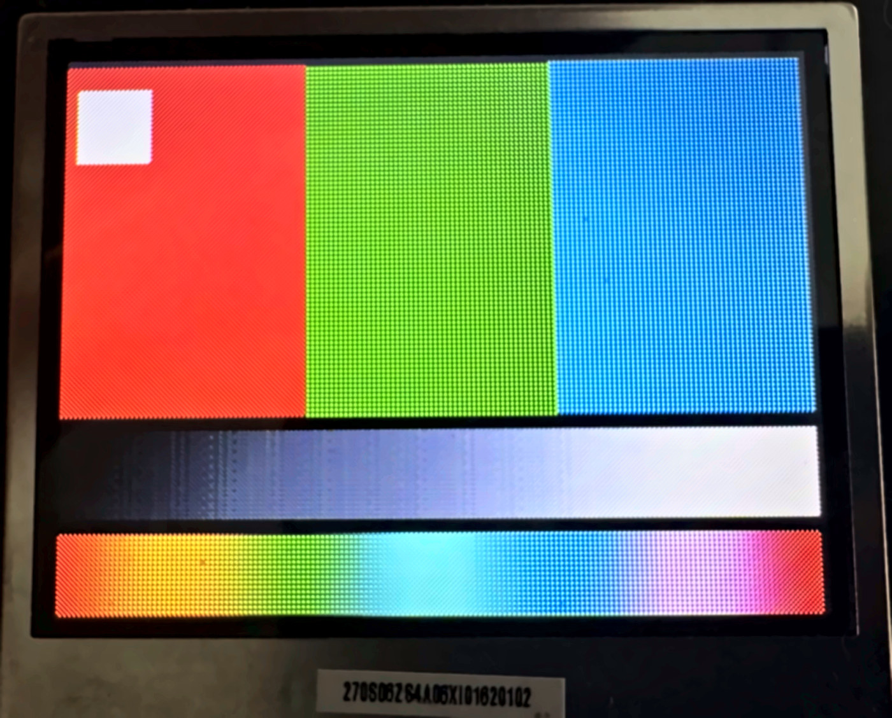

# Board Reverse Engineering

This file contains the condensed hardware-teardown notes for the HP Photosmart TouchSmart LCD panel used in this repository.

## Recovered hardware

- AUO `59.02A42.005` / A024CN02-family LCD
- HP `CN245-60001` TouchSmart panel PCB
- Cypress `CY8C20546-24PVXI`
- 40-pin LCD FPC
- raw 8-bit parallel video interface

## Main discovery

The Cypress device is **not** in the framebuffer/video path.

Continuity testing showed that `D0-D7`, `DCLK`, `HSYNC` and `VSYNC` run directly between the former printer-mainboard connector and the LCD FPC.

The PSoC instead connects to `CS`, `SDA`, `SCL`, the touch controls and panel LEDs.

## Backlight

Without the printer mainboard, the LCD accepts video but `LED_ANODE` stays at 0 V.

For development, the backlight is powered from a conservative 3.3 V jumper to `LED_ANODE`.

## Video format

Early timing experiments produced a partial-width image:

After recovering the active timing and sequential RGB-dot arrangement, the panel could display a complete calibration frame:

## From bit-banging to DMA

GPIO bit-banging proved the electrical pinout and sync timing, but short DCLK pauses caused white flashes.

The stable implementation therefore uses ESP32 I2S0 in LCD/parallel mode with DMA. DCLK, sync and data continue in hardware while the CPUs handle UI rendering, Wi-Fi, NTP and weather requests.

See the main [README](../README.md) for the full pinout and project overview.
